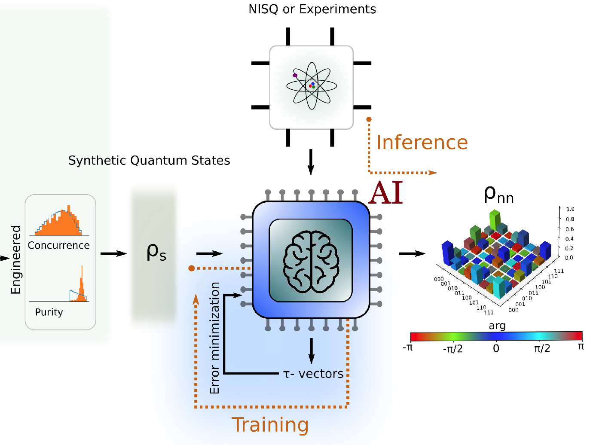

<!-- PROJECT LOGO -->
<br />
<p align="center">
  <a href="https://github.com/slohani-ai/LG-OAM-simulations-with-Tensors/">
    
  </a>

  <h3 align="center">Data-centric ML in Quantum Information Science</h3>

Author: [Sanjaya Lohani](https://sanjayalohani.com)

*Please report bugs at slohani@mlphys.com

Thanks to [Brian T. Kirby](https://briankirby.github.io/), [Ryan T. Glasser](http://www.tulane.edu/~rglasser97/), [Sean D. Huver](https://developer.nvidia.com/blog/author/shuver/) and [Thomas A. Searles](https://ece.uic.edu/profiles/searles-thomas/)

Preprint:

Lohani, S., Lukens, J.M., Glasser, R.T., Searles, T.A. and Kirby, B.T., 2022. Data-Centric Machine Learning in Quantum Information Science. arXiv preprint arXiv:2201.09134.

## Built With
* [mlphys](https://pypi.org/project/mlphys/)
* [tensorflow >=2.4](https://www.tensorflow.org/)
* [qiskit](https://qiskit.org)


<!-- GETTING STARTED -->
## Getting Started

```pip install mlphys```

<!-- USAGE EXAMPLES -->
## Usage
### Simulating various distributions and measurements (including inferences)
```sh
import mlphys.deepqis.Simulator.Distributions as dist
import mlphys.deepqis.Simulator.Measurements as meas
import mlphys.deepqis.utils.Alpha_Measure as find_alpha
import mlphys.deepqis.utils.Concurrence_Measure as find_con
import mlphys.deepqis.utils.Purity_Measure as find_pm
import mlphys.deepqis.network.Inference as inference
import mlphys.deepqis.utils.Fidelity_Measure as fm
...
```
### Sub-module
* <a href="https://github.com/slohani-ai/machine-learning-for-physical-sciences/tree/main/mlphys/deepqis">deepQis</a>

### Tutorials
_For examples (google colab), please refer to_ 
* [Generating Biased Distributions](https://github.com/slohani-ai/machine-learning-for-physical-sciences/blob/main/mlphys/deepqis/Biased_distributions_random_Q_states.ipynb). 
* [Inference Examples](https://github.com/slohani-ai/machine-learning-for-physical-sciences/blob/main/mlphys/deepqis/Inference_examples.ipynb).

## Hands-on coding examples for the results
* **Reducing spurious correlations:**
    * Accuracy of entanglement-separability classification - [Fig 2 (a)](https://github.com/slohani-ai/data-centric-in-qis/blob/master/Toy-model/MEMS/plots/Fig%202%20a.ipynb)
    * network reconstruction fidelity versus the percentage of separable states added to a training set containing entangled states - [Fig 2 (b)](https://github.com/slohani-ai/data-centric-in-qis/blob/master/Toy-model/MEMS/plots/Fig%202%20b.ipynb)
    * Reconstruction fidelity for test states from the MA distribution for a MEMS-only trained network and after adding a small
fraction of separable states into the training set - [Fig 2 (c, d)](https://github.com/slohani-ai/data-centric-in-qis/blob/master/Toy-model/CP_werner_with_MA/Fig%202%20c%20and%20d.ipynb)
* **Reconstruction fidelity versus number of trainable parameters for various training set distributions:**
    * Data-centric approach (Fidelity versus trainable parameters) - [Fig 3](https://github.com/slohani-ai/data-centric-in-qis/blob/master/Distributions/Simulation/plots/Fidelity_vs_trainable_params/Fig%203.ipynb)  
    * The concurrence and purity of random quantum states from the Hilbert–Schmidt–Haar (HS–Haar), Zyczkowski (Z), ˙
engineered, and IBM Q distributions - [Fig 3 insets](https://github.com/slohani-ai/data-centric-in-qis/blob/master/Distributions/Simulation/plots/histograms/Fig%203%20insets.ipynb)
* **Engineered states on concurrence-purity plane:**
    * The engineered and IBM Q sets - [Fig 4](https://github.com/slohani-ai/data-centric-in-qis/blob/master/Toy-model/CP_werner_with_MA/Fig%204.ipynb)
* **Data-centric approach in the low-shot regime:**
    * Reconstructing the NISQ-sampled distribution with simulated measurements performed with shots ranging from 128 to 8192 - [Fig 5](https://github.com/slohani-ai/data-centric-in-qis/blob/master/Distributions/Simulation/shots_vary/plots/Fig%205.ipynb)  

